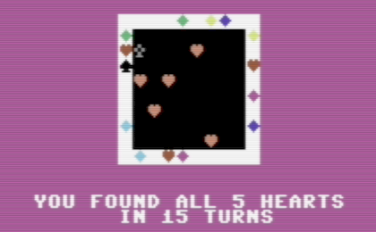

# Collection of C64 Programs

## Code Golf

Challenges and submissions for the C64 Code Golf on 7 July 2024 in Bonn, published in [Digital Talk 115](https://digitaltalk.at/) and in *Commodore 64. Past, Present, and Future of a Home Computer* (2025).

[→ to the range](codegolf)

## Heart 2 Find

A little C64 game in BASIC for Valentine's Day. Find all five hearts by sending messages into a grid. The return signal will give you a hint. But the number of tries is limited ... based on "Black Box" by Eric Solomon.

**Files:** [.d64 for Emulators](heart2find/heart2find.d64) | [.prg for Emulators](heart2find/heart2find.prg) | [.txt for copy/paste into VICE](heart2find/heart2find.txt)

## Atascify

A <10-liner to modify the C64 PETSCII charset to a more ATASCII-like appearance.

**Files:** [.d64 for Emulators](atascify/atascify.d64) | [.prg for Emulators](atascify/atascify.prg) | [.txt for copy/paste into VICE](atascify/atascify.txt)
